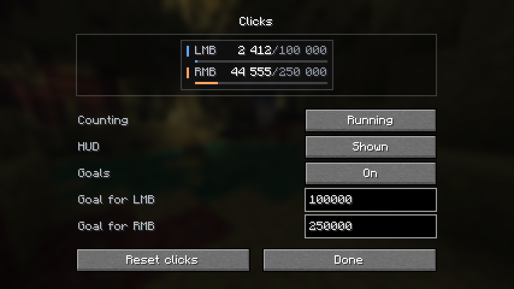

<div align="center">

# Clicks

Your clicks, counted.

A small Fabric mod that tracks left and right mouse clicks across sessions.


<a href="#english"> English</a> · <a href="#russian"> Русский</a>



</div>

<a id="english"></a>

##  English

<table>
<tr>
<td width="33%" valign="top"><strong>Keep your total</strong><br>Separate left and right counters, saved between sessions. Pause whenever you like.</td>
<td width="33%" valign="top"><strong>Set a goal</strong><br>Give each button a target. Progress bars turn green when you reach it.</td>
<td width="33%" valign="top"><strong>Make room</strong><br>Drag the HUD while chat is open, or hide it and keep counting.</td>
</tr>
</table>

### Install

Put the Clicks JAR and **Fabric API** in your instance's `mods` folder. Use **Fabric Loader 0.19.0 or newer** and the JAR for your exact Minecraft version. Install **Mod Menu** to open the settings.

Clicks runs on the client; the server does not need it. It counts button presses while you are in a world with no screen open. Inventory, menu and chat clicks are excluded. Holding a button counts once.

### Use

Open **Mod Menu → Clicks → Configure**. The preview updates as you change the settings.

| Control | What it does |
| --- | --- |
| Counting | Pause or resume without losing your totals. |
| HUD | Show or hide the panel. Counting continues while hidden. |
| Goals | Enable separate targets for LMB and RMB. Leave a target empty or set it to `0` to disable it. |
| Reset clicks | Clear both counters. Click again within four seconds to confirm. |

To move the panel, open chat and drag it with the left mouse button. Its position is saved when you release it.

Totals and settings live in `config/clicks.properties`, shared across worlds and servers within that Minecraft instance. Changes are saved every 1,200 client ticks (about a minute), on normal shutdown, and when you close the settings. The interface follows the game's language, with English and Russian translations.

### Versions

<details>
<summary><strong>Available build targets · 34 versions</strong></summary>

| Series | Versions |
| --- | --- |
| 1.16 | 1.16.5 |
| 1.17 | 1.17, 1.17.1 |
| 1.18 | 1.18, 1.18.1, 1.18.2 |
| 1.19 | 1.19, 1.19.1, 1.19.2, 1.19.3, 1.19.4 |
| 1.20 | 1.20, 1.20.1, 1.20.2, 1.20.3, 1.20.4, 1.20.5, 1.20.6 |
| 1.21 | 1.21, 1.21.1, 1.21.2, 1.21.3, 1.21.4, 1.21.5, 1.21.6, 1.21.7, 1.21.8, 1.21.9, 1.21.10, 1.21.11 |
| 26.x | 26.1, 26.1.1, 26.1.2, 26.2 |

Each target has its own JAR: `clicks-1.0.0+<minecraft-version>.jar`.

</details>

### Build

Use JDK 21 for targets through 1.21.11, or JDK 25 for 26.x.

```sh
./gradlew build -Pmc=1.20.1
```

On Windows PowerShell:

```powershell
.\gradlew.bat build '-Pmc=1.20.1'
```

Output: `build/libs/`. The default target is **1.21.11**.

---

<a id="russian"></a>

##  Русский

Небольшой Fabric-мод, который считает нажатия ЛКМ и ПКМ и сохраняет результат между запусками.

<table>
<tr>
<td width="33%" valign="top"><strong>Сохраняй результат</strong><br>Отдельный счёт для каждой кнопки, общий между запусками. Подсчёт можно поставить на паузу.</td>
<td width="33%" valign="top"><strong>Задавай цели</strong><br>У каждой кнопки своя цель. Когда она достигнута, полоска прогресса становится зелёной.</td>
<td width="33%" valign="top"><strong>Освобождай экран</strong><br>Перетащи панель в открытом чате или скрой её — подсчёт продолжится.</td>
</tr>
</table>

### Установка

Положи JAR Clicks и **Fabric API** в папку `mods` своей сборки. Нужен **Fabric Loader 0.19.0 или новее**. Выбирай файл точно под свою версию Minecraft. Для доступа к настройкам установи **Mod Menu**.

Мод работает на клиенте, на сервер его ставить не нужно. Учитываются нажатия во время игры, когда закрыты все экраны. Клики в инвентаре, меню и чате пропускаются. Удержание кнопки считается одним нажатием.

### Управление

Открой **Mod Menu → Clicks → Настройки**. Предпросмотр сразу показывает изменения.

| Настройка | Действие |
| --- | --- |
| Подсчёт | Пауза и продолжение с сохранением текущего счёта. |
| Худ | Показать или скрыть панель. Скрытие не останавливает подсчёт. |
| Цели | Отдельная цель для ЛКМ и ПКМ. Пустое поле или `0` отключает цель этой кнопки. |
| Сбросить клики | Обнулить оба счётчика. Для подтверждения нажми ещё раз в течение четырёх секунд. |

Чтобы переместить панель, открой чат и перетащи её левой кнопкой мыши. Позиция сохраняется при отпускании кнопки.

Счёт и настройки хранятся в `config/clicks.properties` и общие для всех миров и серверов внутри одной сборки Minecraft. Изменения сохраняются каждые 1 200 клиентских тиков (примерно раз в минуту), при обычном выходе из игры и при закрытии настроек. Язык интерфейса выбирается по языку игры; есть русский и английский.

### Версии и сборка

В проекте 34 цели сборки, от **1.16.5 до 26.2**. На каждую версию свой файл: `clicks-1.0.0+<версия-minecraft>.jar`. [Полный список версий](#versions).

Для сборки до 1.21.11 включительно нужен JDK 21, для 26.x — JDK 25.

```powershell
.\gradlew.bat build '-Pmc=1.20.1'
```

На Linux и macOS: `./gradlew build -Pmc=1.20.1`. Файлы появятся в `build/libs/`. По умолчанию собирается **1.21.11**.

<a href="#english"> English</a> · <a href="#russian"> Русский</a>

---

Copyright © 2026 **Spolzer**. [All rights reserved / Все права защищены (ARR)](LICENSE).
